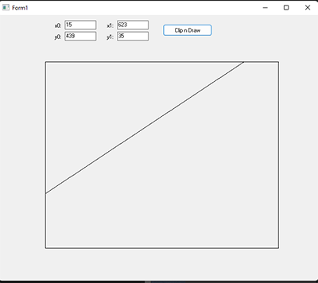

# CohenSutherland
Cohen Sutherland line clipping in Pascal ( Delphi )

This is a port of C code from Wikipedia to Delphi:  

   http://en.wikipedia.org/wiki/Cohen%E2%80%93Sutherland

The test application (VCL) can be used either by typing the line end-points coordinates or by clicking two points on the form.

# Algorithm Usage 

1- Add unit to uses

    uses                           
       CohenSutherlandClipping;

2- Set clipping rectangle

    var x0,y0,x1,y1:Double;
    begin
      x0 := 10;   y0 := 10;  x1 := 100;  y1 := 200; 
      CohenSutherland_SetClippingRect(xmin, ymin, xmax, ymax ); 
      ...
    
3- Test line clipping

    var x0,y0,x1,y1:Double;
    begin
      x0 := 0;   y0 := 0;  x1 := 300;  y1 := 400;       // set line segmenmt end points
      if CohenSutherland_LineVisible(x0,y0,x1,y1) then  // if line is visible, x0,y0,x1,y1 returns clipped line end points
         begin
           Canvas.MoveTo( Trunc(x0),  Trunc(y0) );      // draw line segment
           Canvas.LineTo( Trunc(x1),  Trunc(y1) );
         end;
     
App tested with Delphi 11.1

Originally I did this port to use with graphics32, because the standard "Safe" clipping TBitmap32.LineToAS() didn't work for large x, y ( this was for 2012, don't know if it works now ). Anyway, this algorithm can be used with any graphics (ex: FMX) 

